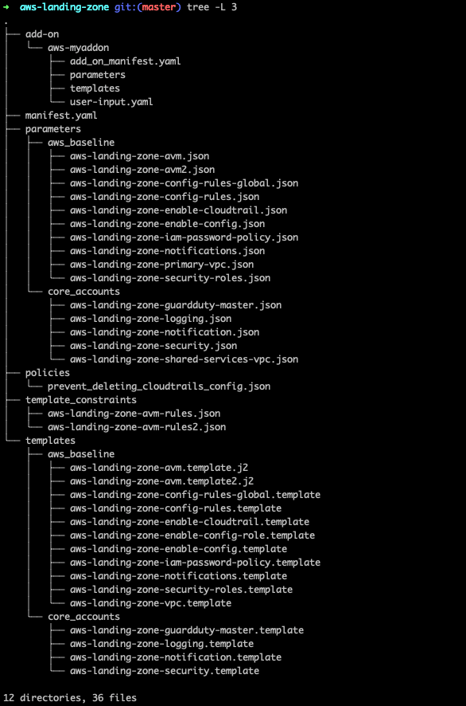
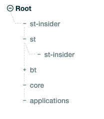
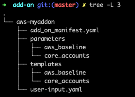

## Folder Structure



### Manifest Overview

```yaml
---
#Default region for deploying AWS Landing Zone assets: Code Pipeline, Step functions, Lambda, SSM parameters, Service Catalog Portfolio/Products and StackSets
region: us-east-1
version: 2018-06-14
lock_down_stack_sets_role: No
nested_ou_delimiter: ":" # the value for this key must be in single quotes

# Landing Zone Core Account Structure
organizational_units:
# Landing Zone Service Control Policies
organization_policies:
# Landing Zone Service Catalog portolfios/products (Optional/Baseline)
portfolios:
# Landing Zone Service Baseline Resources
baseline_resources:
```

### Organizational Units

This section describes AWS org structure for your core accounts. this section includes related CF templates to creates resources in Core accounts.

```yaml
organizational_units:
  # Landing Zone OU for Core accounts
  - name: core # can be ":" delimiter for nested OUs
    include_in_baseline_products:
      - AWS-Landing-Zone-Account-Vending-Machine
    core_accounts:
```

**Ex:**


Default Core accounts:

1. primary
2. security
3. log-archive
4. shared-services
   In above example your `- name` like

```yaml
organizational_units:
  # Landing Zone OU for Core accounts
  - name: st:st-insider # can be ":" delimiter for nested OUs
    include_in_baseline_products:
      - AWS-Landing-Zone-Account-Vending-Machine
    core_accounts:
```

`core_accounts` represents management accounts to manage managed accounts.

Each section of `core_accounts` looks like below

```yaml
- name: shared-services
        email: sssalim+lz3sharedservices@amazon.com
        ssm_parameters:
          - name: /org/member/sharedservices/account_id
            value: $[AccountId]
        core_resources:
          - name: SharedServicesAccountVPC
            template_file: templates/aws_baseline/aws-landing-zone-vpc.template
            parameter_file: parameters/core_accounts/aws-landing-zone-shared-services-vpc.json
            deploy_method: stack_set
            regions:
              - us-east-1
            ssm_parameters:
              - name: /org/member/sharedservices/vpc_region
                value: $[output_VPCRegion]
              - name: /org/member/sharedservices/vpc_cidr
                value: $[output_VPCCIDR]
              - name: /org/member/sharedservices/vpc_id
                value: $[output_VPCID]
              - name: /org/member/sharedservices/private_subnet1_cidr
                value: $[output_PrivateSubnet1ACIDR]
              - name: /org/member/sharedservices/private_subnet1_id
                value: $[output_PrivateSubnet1AID]
              - name: /org/member/sharedservices/private_subnet2_cidr
                value: $[output_PrivateSubnet2ACIDR]
              - name: /org/member/sharedservices/private_subnet2_id
                value: $[output_PrivateSubnet2AID]
              - name: /org/member/sharedservices/public_subnet1_cidr
                value: $[output_PublicSubnet1CIDR]
              - name: /org/member/sharedservices/public_subnet1_id
                value: $[output_PublicSubnet1ID]
              - name: /org/member/sharedservices/public_subnet2_cidr
                value: $[output_PublicSubnet2CIDR]
              - name: /org/member/sharedservices/public_subnet2_id
                value: $[output_PublicSubnet2ID]
              - name: /org/member/sharedservices/vpc_private_route_ids
                value: $[output_PrivateSubnetRouteTables]
```

each core account consists of following components

1. **email**: which is used to create core account in AWS org
2. **ssm_parameters**: params you want to pull from SSM
3. **core_resources**: Resources that you want to deploy in each core account.
   In above example we are deploying an VPC in shared service account. these resources will be defined unser core_accounts.
   Each core_resources consist of following fields
   1. **name**: Name of the resource you want to crate( This name will be used to create stack sets in Cloud formation)
   2. **template_file**: CF template to create resource.
   3. **parameter_file**: Params you want to pass to this CF template file
   4. **deploy_method**: `stack_set`
   5. **regions**: this is a list of regions you want to deploy these resoruces, can be more than 1 region
   6. **ssm_parameters**: Use existing SSM params to pass to CF template

**Note:**
Dont change this Core Account

```yaml
# Organization's Master account
- name: primary # NOTE: DO NOT MODIFY THIS ACCOUNT NAME AND IT SHOULD BE THE LAST CORE ACCOUNT IN THE LIST
  ssm_parameters:
    # SSM parameter to hold the AWS Account ID of Organization's Master Account
    - name: /org/primary/account_id
      value: $[AccountId]
    # SSM parameter to hold the Email ID of Organization's Master Account
    - name: /org/primary/email_id
      value: $[AccountEmail]
    # SSM parameter to hold the Organization ID
    - name: /org/primary/organization_id
      value: $[OrganizationId]
  core_resources: []
```

### organization_policies

This section in manifest file controls the SCP on each account. You can choose on which accounts you can apply these SCPs.

```yaml
organization_policies:
  - name: protect-cloudtrail-config
    description: To prevent from deleting or disabling CloudTrail and Config
    policy_file: policies/prevent_deleting_cloudtrails_config.json
    #Apply to accounts in the following OU(s)
    apply_to_accounts_in_ou:
      - core
      - applications
```

**Ref Link:**
https://docs.aws.amazon.com/organizations/latest/userguide/orgs_manage_policies_scp.html

### portfolios

This section of manifest allow us to create Service catalog portfolio and products for account baseline and add-on products.
In `portfolios` section you will add list of `products` you want to create as a part of Service catalog portfolio.

```yaml
portfolios:
  - name: AWS Landing Zone - Baseline
    description: Baseline Products for AWS Landing Zone
    owner: AWS Solutions
    principal_role: $[alfred_ssm_/org/primary/service_catalog/principal/role_arn]
    products:
      - name: AWS-Landing-Zone-Account-Vending-Machine
        description: (SO0045) - AWS Landing Zone - Account Vending Machine Template
        template_file: ""
        # This is the skeleton template for the AVM
        skeleton_file: templates/aws_baseline/aws-landing-zone-avm.template.j2
        parameter_file: parameters/aws_baseline/aws-landing-zone-avm.json
        rules_file: template_constraints/aws-landing-zone-avm-rules.json
        # Hide/Disable the old version of the product in Service Catalog
        hide_old_versions: true
        # Is this is a baseline product? e.g. AVM ?
        product_type: baseline
        launch_constraint_role: $[alfred_ssm_/org/primary/service_catalog/constraint/role_arn]
```

Each product consist of following fields

1. **name**: Name to use for the AWS Service Catalog product name.
2. **skeleton_file**: Jinja2 skeleton template that will be used to create the final AWS Service Catalog product. use if `product_type = baseline`
3. **rules_file**: Template constraint rules file for AWS Service Catalog product,use if `product_type = baseline`
4. **hide_old_versions**:Configures whether or not AWS Landing Zone will hide previous versions of the product in AWS Service Catalog
5. **product_type**: Determines whether the product is an account configuration baseline or an optional,Required if `product_type = optional`
6. **launch_constraint_role**: IAM role ARN to be used for the AWS Service Catalog product launch constrain
7. **template_file**: Location relative to the manifest file for a base AWS CloudFormation template

### baseline_resources

This section contains base line resources that you want to create in managed account(accounts that are provisioned from Service catalog).
This is the responsible for creating stacksets and stack instances.
in Base line resource each resource looks like

```yaml
  - name: EnableCloudTrail
    # This resource is part of which baseline(s) product
    baseline_products:
      - AWS-Landing-Zone-Account-Vending-Machine
    template_file: templates/aws_baseline/aws-landing-zone-enable-cloudtrail.template
    parameter_file: parameters/aws_baseline/aws-landing-zone-enable-cloudtrail.json
    deploy_method: stack_set
    depends_on:
        - resource_name
```
**baseline_products** refers to portfolios product.

### AWS Landing Zone Add-Ons

This allow us to extend the Landing Zone implementation by dropping in the add-on Micro-configuration into your existing Landing Zone Configuration.
This manifest follows same as main `manifest.yml` file.
**Folder Structure:**

